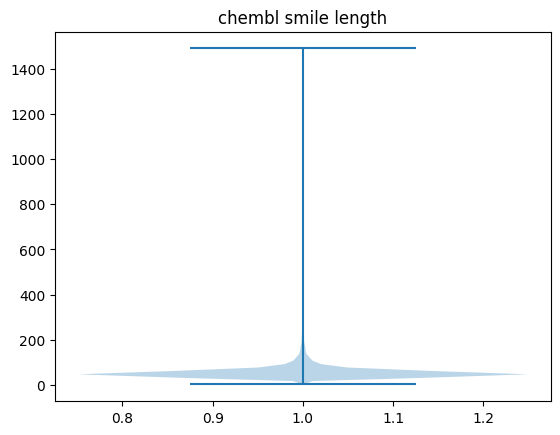

## Data processing

tokenizer.py was followed the original paper Generative Tensorial Reinforcement Learning (GENTRL) 

1. Delete ions

previous chembl total compound:  2131413

mean +/- std tokens : 58.506 +/- 45.148

2.1 set max length = 200

if set token max length == 200, 31038 compounds will be truncated. Thus we delete those in our data set. Data set shape: (2100375, 200)

2.2 set max length = 120

