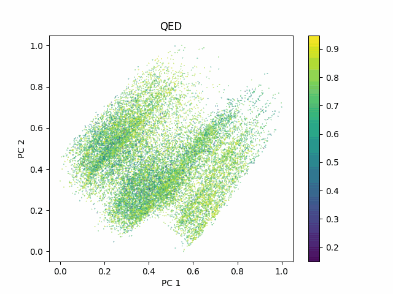
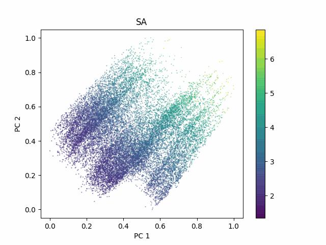
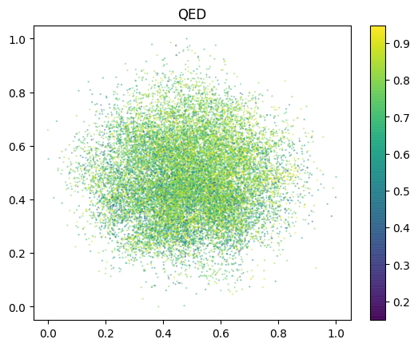
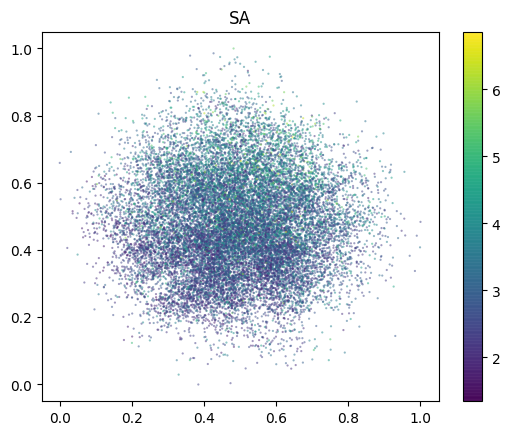
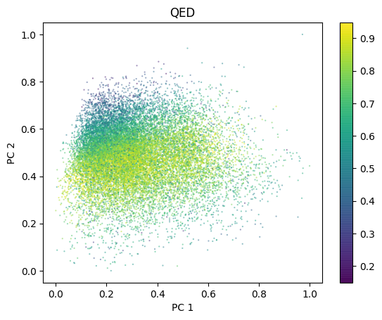
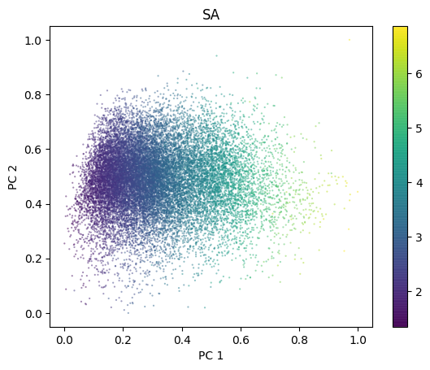
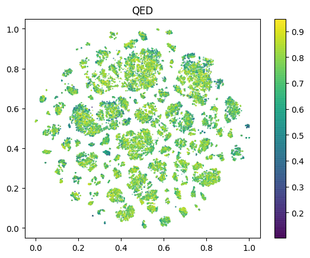
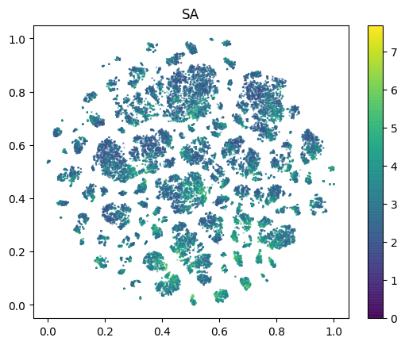
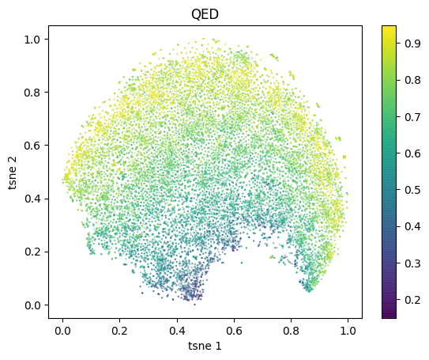
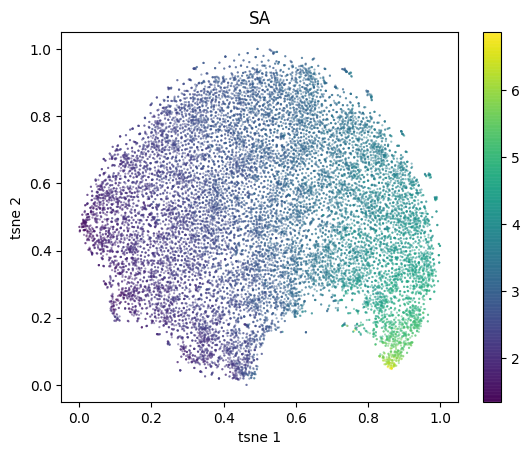

#### RNN VAE latent space
Reference: Gómez-Bombarelli, Rafael, et al. "Automatic chemical design using a data-driven continuous representation of molecules." ACS central science 4.2 (2018): 268-276.
 
 | PCA | latent space QED    | latent space SA
:-----:|:-------------------------:|:-------------------------:
|with classifier|   |  |

 | PCA | latent space QED    | latent space SA
 :-----:|:-------------------------:|:-------------------------:
 | no classifier |    |   |
 | with classifier |    |   |

 | t-SNE | latent space QED, with classifier    | latent space SA, with classifier  
 :-----:|:-------------------------:|:-------------------------:
 | no classifier |    |   |
 | with classifier |    |   |

