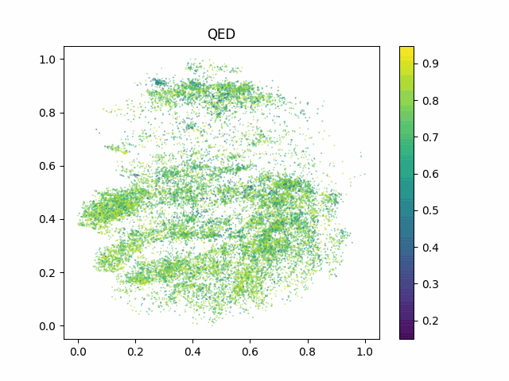

#### LSTM VAE latent space
Reference: Gómez-Bombarelli, Rafael, et al. "Automatic chemical design using a data-driven continuous representation of molecules." ACS central science 4.2 (2018): 268-276.

 | Dim reduction | latent space QED, no classifier    | latent space SA, no classifier  
 :-----:|:-------------------------:|:-------------------------:
 | PCA |    |   |
 | t-SNE |    |   |

 | Dim reduction | latent space QED, with classifier    | latent space SA, with classifier  
 :-----:|:-------------------------:|:-------------------------:
 | PCA |    |   |
 | t-SNE |    |   |

 
